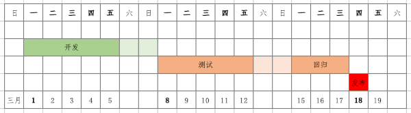

# Sprint / 迭代

考虑一个从 `3月1日启动开发` 到 `3月18日发布到生产` 的，耗时 `3 周` 的迭代。

*为简化问题，此处不涉及需求澄清的时效，不涉及需求变更或撤出。*

关于工作周期划分：

1. 03/01 - 03/05 是开发阶段，03/08 - 03/12 是功能测试阶段，所有的功能开发必须在 03/08 早上 9:00 前完成，并移交测试
2. 03/15 - 03/17 是冻结开发、集成测试、回归测试阶段
3. 03/18 发版
4. 03/18 - 03/19 的富余时间做迭代回顾

关于移测窗口：

1. 为了将工期往前赶，应该早开发早移测，03/01 启动开发的 Story 应该在 03/04 早上 9:00 前完成，并移交测试，03/02 应该在 03/05，以此类推
2. 因此实际的移测并不是一个时间点，而是自 03/04 09:00 AM - 03/08 09:00 AM 的一个时间窗口
3. 03/04 - 03/05 启动开发的 Story 仍然应该保证在 03/08 09:00 AM 移测，如果做到了，这就是赶出来的管理储备，如果没做到，应该保证在 03/10 09:00 AM 移测

关于需求交付口径 Story：

1. 从业务方视角出发，将一个完整的需求视作一个 Story；要注意这里不是技术视角的功能点，常规的敏捷实践会要求将 Story 划分得更精细一些，也有不能超过 3-5 人天的说法，但这里并不是的；一个稍大的 Story 会需要多人协同，不同的 Story 也可能有前后甚至平行的依赖；Story 是一个微型的项目管理
2. Story 是业务、开发、测试等多方沟通的一个口径拉通
3. 鼓励开发将 Story 拆分成更正交的故事点，以 DAG 的形式去管理项目进度，但不会在这个粒度上进行管理，管理的粒度始终是 Story；同样的，鼓励开发拆分 Task，但不会在这个粒度上进行管理
4. 当 Story 出现前后或平行的依赖，建议由开发来抹平这个门槛；即由开发通过设计一系列正交的 Task 并依照一定的依赖顺序去先后实现，但交付口径仍然是 Story；一些难以正交的场景下，甚至建议合并 Story，让 Story 更大，始终以保持交付口径统一为原则
5. 鼓励开发使用一些效率管理工具，但不建议做 API 级别的对接，Story 是项目汇报的性质，是人工的
