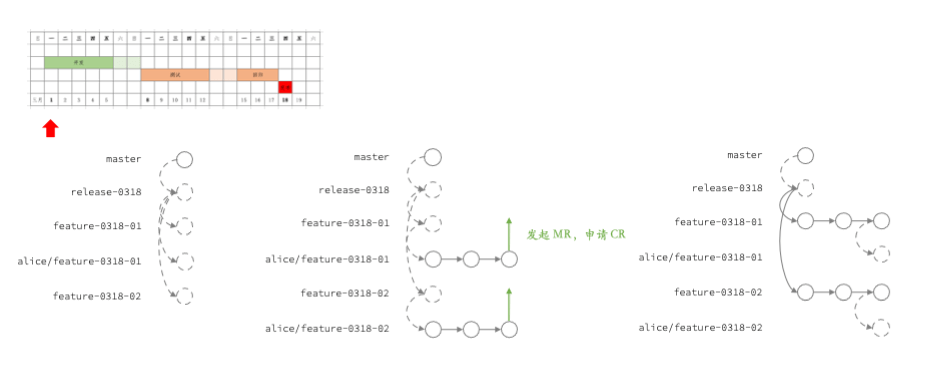
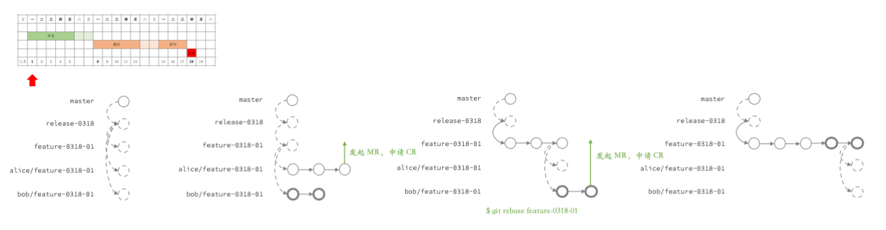
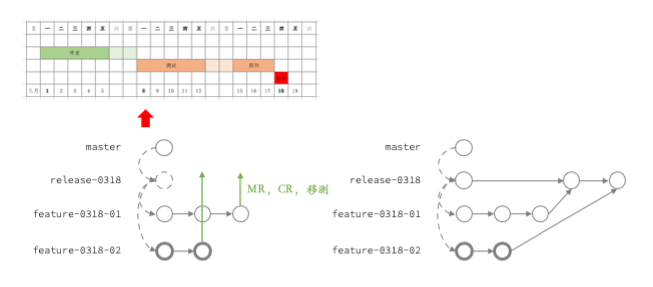
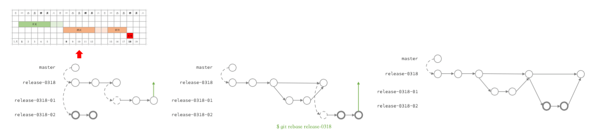
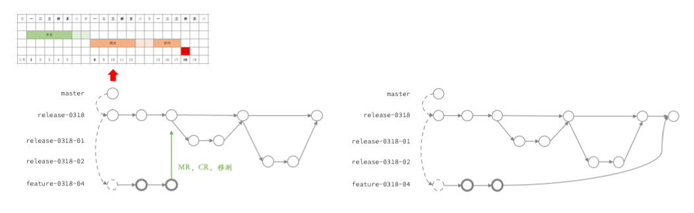

# Trunk Based Development

####  一些 Git 的基本文化

1. 应该学习 `git merge --ff` 和 `git merge --no-fff` 的区别，其中 `--ff` 是默认设置（注意，Gitlab 的 squash 选项不是 ff，这个功能毫无意义而且向开发传达了极为错误的实践）
2. 应该学习 `git pull --rebase`，`git rebase` 和 `git rebase -i`
3. 应该学习 `git push --force`，但要非常谨慎
4. 绝大部分的分支应该是 `短生命分支`，这是 Git 的文化，也是最佳实践
5. 推荐使用 `/` 作为分支分组，因为会在可视化中以可折叠的文件夹的形式呈现
6. 每个分支都会有 `源 origin` 和 `本地 local` 两份，`本地` 会追踪 `源`
7. 每个人应该有自己的工作分支，注意这里并不是指本地的分支，而是区分出个人的工作空间（所以比较繁琐和完整的说法应该是，每个人对每个分支都应该有对应的个人工作分支）
8. 每次的提交应该是从个人的工作分支挑选需要提交的部分 `commit`，将这一组 `commit` *更新* 到本地功能分支上，然后从本地功能分支 **往** 源功能分支提交 `merge request`
9. 鼓励在个人工作分支频繁提交
 `commit`，鼓励在个人工作分支频繁 `rebase`，这样可以保留思考过程；鼓励个人工作分支频繁上传到源个人工作分支，这样可以起到备份的作用
10. 从个人工作分支往本地功能分支选择 commit 的时候要非常慎重，因为这些 commit 是用来被 `code review` 的，所以要从 review 方的视角出发，要符合一定的业务逻辑（你是来考试的，你确实想考过）；慎重包括了选择合适的 commit，并 rebase 到合适的顺序；不要把 merge request 当作草稿箱
11. 考虑到目前没有特别好用的流水线工具支持，不允许出现硬回滚，所有的修复都应该是向前的，包括需求撤出也必须是用新的删除提交去覆盖

#### 原则 / 目标

1. 任何时刻，`master` 上的代码都是可以部署到生产环境的；以及，任何时刻各功能分支能部署到各自的功能环境，这里可能会不满足完整集成的要求，但至少要对该功能周边的集成负责
2. 一旦合并入 `master` 分支，就应该立刻部署到生产环境；依次类推，应该鼓励 `持续提交`、`持续部署`

#### 开发前准备阶段

1. 主要指项目和流程管理上的准备，不是技术架构设计评审
2. 参考 [Sprint / 迭代](./sprint) 的内容，确认 Story 之间的依赖关系，对于复杂的情况，优先使用将多个 Story 合并成一个大 Story 的方式
3. 指定每个 Story 的参与者
4. 到 Gitlab 上将默认合并策略设置为 `fast-forward`，因此所有的 feature 往 feature，release 往 release 的合并请求，即 code review 过程都可以在界面上完成，reviewer 可以直接点击合并按钮；feature 往 release 的合并请求，意义是移测，这是一个项目管理动作，不是 code review 过程，由于目前 Gitlab 不支持直接合并，所以需要在线下手工完成

#### 开发阶段

1. 从 `master` 签出一个 `release-0318` 备用，以预期发布到生产的日期来命名
    1. 会在 Gitlab 上保留一个 merge request，是从 `release-0318` 指向上一个 `master`，实践意义是 diff，用来全局视角观测这个迭代变更了什么
2. 为每一个 `Story` 签出一个分支，命名为 `feature-0318-01`，以预期发布到生产的日期，和 Story 的 Id 来命名
    1. 每个人应该从自己参与的 Story 签出工作分支 `alice/feature-0318-01`
    2. **每天** 应该从工作分支往需求分支合并当天的内容，此处 `merge request` 的实践意义是 `code review`

3. `feature-0318-01` 是多人协作的，后提交的人需要 `git pull --rebase`

4. 如果存在多个 Story 有前后依赖的情况，比如 `feature-0318-03` 依赖 `feature-0318-02`，那么应当经常以 `02` 为基准执行 `rebase`
    1. 所以，`reviewer` 要记得在合并了 `02` 后，人工将 `03` rebase 到最新的 `02`
5. 注意以上我们乐观的预设了不存在多个 Story 修改同一个文件的场景，这一方面是因为对 Story 的拆分是粗粒度的，另一方面是因为我们使用了 monorepo 模式
    1. 如果真的遇到修改同一个文件的场景，建议使用 `git cherry-pick`，即将同一个 commit 在多个分支 *复制多遍*，等到合并的时候一次性处理冲突

#### 移测窗口阶段

1. 移测意味着预交付，要以交付的标准要求自己
2. 目前没有功能测试，只有集成测试，这可能是一个成本相对划算的策略；如果未来有自动化测试能力，可能会落实部分功能测试，但如果只有手工测试的话，可能会长期坚持只有集成测试的策略
3. 集成测试的目标是将 `feature-0318-01`，`feature-0318-02` 等合并进 `release-0318`，然后用 `release-0318` 这个 **唯一的移测分支** 发布到测试环境，这里要强调的是，**每次合并完成后需要发布所有代码**
    1. 目前没有工具来支持这个过程，所以建议使用 `(release-0318) $ git merge feature-0318-01 --no-ff` 的方式合并，这样可以在视觉上明确的标记出一个合并点
4. 为什么要强调这里是集成测试，不是功能测试呢，因为每次合并要求发布所有代码，所以理论上在测的功能并不是独立的，是可能会被新合并进来的代码影响的

4. 在测试过程中发现的问题和对应的修复，应该采取签出 `alice/release-0318` 分支的形式进行；这里为了可读性，**推荐但不强制** 先签出 `release-0318-01` 说明这个是针对 Story 01 的修复，然后签出工作区 `alice/release-0318-01`，然后往 `release-0318-01` 做 code review 合并，然后往 `release-0318` 做移测合并
    1. 注意这里一定要使用短生命周期分支，否则很容易乱的
    2. 在开发阶段 `feature-0318-01` 和 `feature-0318-02` 是平行和独立的关系，在测试阶段的 `release-0318-01` 和 `release-0318-02` 是强制先后的关系；不管 Story 本身是否存在依赖关系，为了最大程度 **保证集成测试使用的是唯一分支、最新代码**，这里要强制先后；实践中执行的动作是需要频繁去 rebase 最新的 release-0318

#### 移测阶段

1. 正式移测阶段和移测窗口阶段，最重要的区别是，窗口阶段允许 `feature-0318-04` 以平行的方式合并进来；即 `feature-0318-04` 的开发者，在已经知晓其他 feature 分支已经移测，并且有可能对自己的分支产生影响的情况下，允许以不知晓的方式进行独立开发和合并
    1. **推荐但不强制** `git cherry-pick` 的形式尽早将可能影响到自己的内容 **复制** 进来，也不和开发质量检查挂钩，即这里是允许存在质量缺陷不追责的；这里用一定程度的牺牲质量，去保证独立功能开发不受干扰，以及协同开发的门槛

2. 所有移测阶段发生的修复，和移测窗口阶段的规范一致，即通过 rebase 到最新的 `release-0318` 然后进行合并

#### 冻结阶段

1. 应该执行严格的 code freeze，单纯的质量 code review 不足以批准合并，要综合考虑对本次迭代发布的影响

#### 多个迭代在时间上存在重叠怎么处理

> 如果迭代是首尾连续的，那么只需要在发布当晚，从 release-0318 签出 release-0401 分支即可。但实践中会采取迭代重叠的做法，即 03/08 移测日完成后，立刻进入下一个迭代的开发阶段，即本次迭代的测试阶段和下个迭代的开发阶段是重叠的。

> 在没有 CI/CD 文化的情况下，这并不是一个好的做法，但它能从纸面上提高吞吐率。

1. 上一个迭代是 release-0304，当前迭代是 release-0318，下一个迭代是 release-0401

2. `原则 1：从当前线上实际部署的版本出签出`。在 03/08 移测日当天，线上实际版本是 `release-0304`，所以 `release-0328` 是从 `release-0304` 签出的
    1. 为了方便判断，在 `release-0304` 部署的当晚，会在此处标记一个分支为 `release-prd`，所以原则 1 可以简化为始终从 `release-prd`
 签出
    2. 这样带来的另一个好处是，如果中间发生了 hotfix，比如 `release-0305-hotfix`，只需要将 `release-prd` 及时指向 `release-0305-hotfix` 就能保持原则 1 的执行不变

    > 由于原则 1，我们会发现当前迭代的代码是基于 n - 2 迭代继续的，并不包含 n - 1 迭代的内容，这就是为什么说让迭代重叠是一个错误的做法；在有 CI/CD 文化的情况下，迭代很短，所以代码差异可能不多。当迭代的长度是 2-3 周的情况下，就必须要求连续的迭代不能对同一个功能进行改动，所以如果以功能点为视角的话，吞吐率是下降的。

3. `原则 2：及时将落后的代码合并进当前迭代，以线上实际部署为准`。在 03/18 当晚发布成功后，应当从 release-0318 往 release-0401 发起合并，并处理冲突
    1. 这里有一个反直觉的经验：所有的 conflict 都必须和开发逐一确认，0318 在线上并不意味着它符合最新的业务需求，同时 0401 是后开发的也并不意味着它符合最新的业务需求；同样是由于迭代重叠的存在，导致业务方需要根据实际情况去调整每个迭代实际发布的功能点，所以两条分支上的代码都有可能分别是对的，需要逐一确认

#### 高阶：Feature Flag

#### 参考文献

1. [GitFlow 为什么是错的](https://insights.thoughtworks.cn/gitflow-consider-harmful/)
2. [Comparing Workflows](http://127.0.0.1:3001/pro-web/ch11/scrum/trunk-based-development.html)
